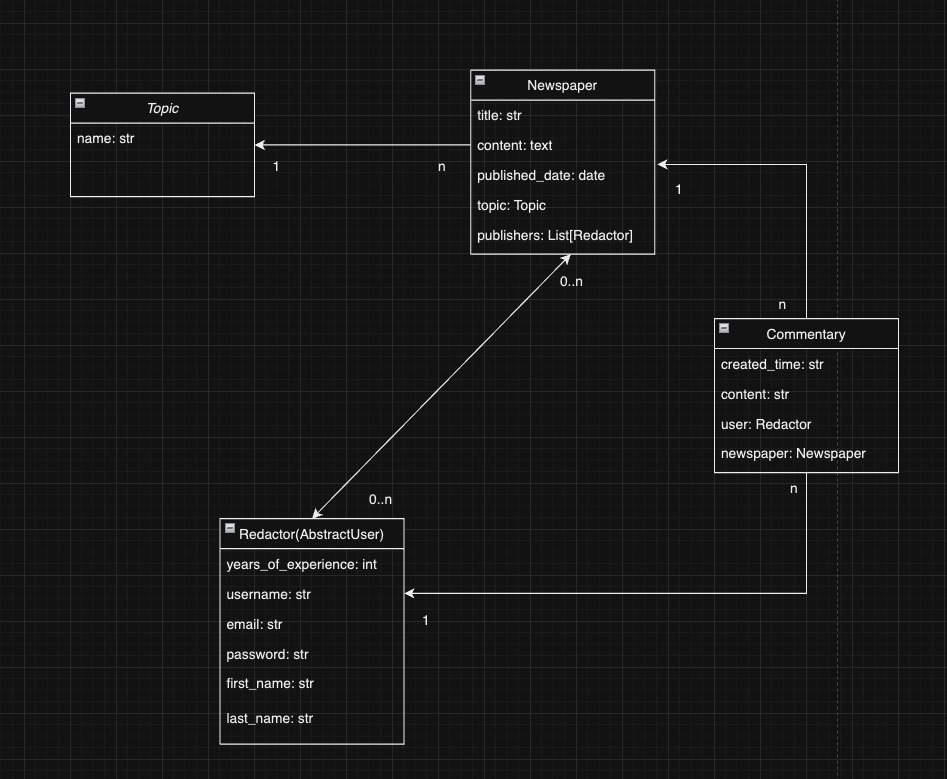
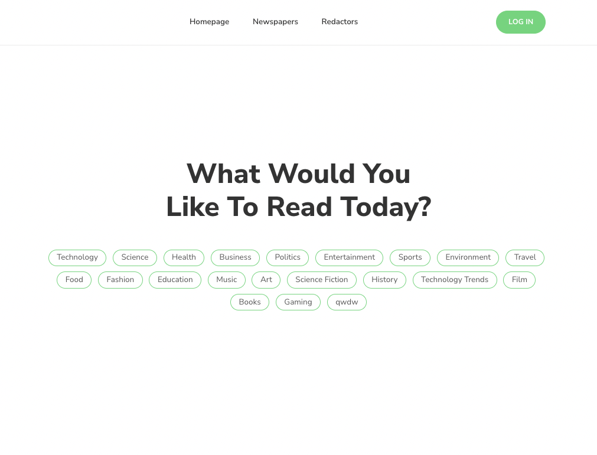

# Newspaper Agency Project

Django project for managing newspapers and redactors.

### Check it out!

[Deployed to Render](https://newspaper-agency-9ve2.onrender.com/)

````
Test user
login: admin
password: xgaEv^kHyhhbguAS
````

## Installation

Python3 must be already installed

For Windows:
```shell
git clone https://github.com/nyanplague/newspaper-agency
cd newspaper-agency
python venv venv
venv\Scripts\activate
pip install -r requirements.txt
python manage.py makemigrations
python manage.py migrate
python manage.py manage.py loaddata newspaper_agency_db_data.json
python manage.py runserver
```
For Mac (and Linux):
```shell
git clone https://github.com/nyanplague/newspaper-agency
cd newspaper-agency
python3 -m venv venv
source venv/bin/activate
pip install -r requirements.txt
python manage.py makemigrations
python manage.py migrate
python manage.py manage.py loaddata newspaper_agency_db_data.json
python manage.py runserver
```

 Project should be accessible at http://localhost:8000/.

## Features
* Authentication for Redactor/User
* Content management, you can do following operations with a newspaper: 
  * create 
  * read
  * update
  * delete
* Managing redactors and topics if you're superuser - also CRUD for every model
* Commenting newspapers for logged on users

## DB structure


## Demo


